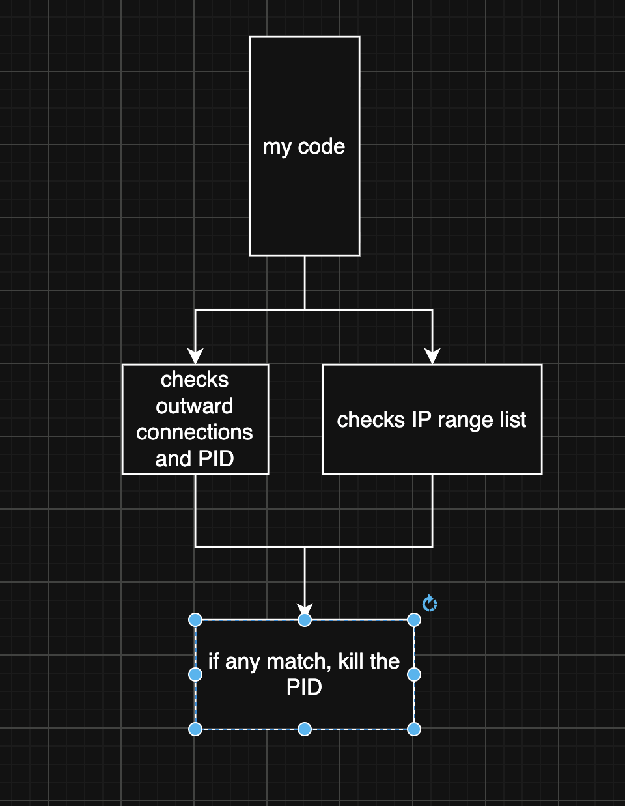

# IP Blocklist Process Monitor

A lightweight Python process monitor for Linux that automatically terminates processes with active network connections to IP addresses contained in a specified IP blocklist.

The script uses `lsof` to inspect live network connections, Python's `ipaddress` module to check remote IPs against CIDR ranges, and `kill -9` to terminate matching processes.

## Features

* Monitors active network connections every second
* Checks remote IP addresses against a CIDR/IP blocklist
* Automatically terminates processes connecting to blocked addresses
* Displays the process name, PID, and blocked IP before termination
* Handles `Ctrl+C` cleanly
* Loads the IP ranges once at startup for faster checks
* Uses standard Python libraries apart from system commands

## Requirements

* Linux
* Python 3
* `lsof`
* A user account with sufficient permissions to inspect and terminate the relevant processes

The script has **not been tested on Windows** and is unlikely to work without significant modifications because it relies on Linux-style commands such as `lsof` and `kill`.

## Installation

Clone the repository:

```bash
git clone https://github.com/YOUR-USERNAME/YOUR-REPOSITORY.git
cd YOUR-REPOSITORY
```

Make sure `lsof` is installed:

```bash
sudo apt install lsof
```

Other Linux distributions may use a different package manager.

## Getting an IP Blocklist

This example uses IPdeny aggregated country ranges.

Download the desired blocklist from:

https://www.ipdeny.com/ipblocks/data/aggregated/us-aggregated.zone

For example:

```bash
wget https://www.ipdeny.com/ipblocks/data/aggregated/us-aggregated.zone
```

Then update `FILE_PATH` in the script:

```python
FILE_PATH = "~/us-aggregated.zone.txt"
```

You can replace the blocklist with another file containing CIDR ranges, for example:

```text
1.2.3.0/24
5.6.0.0/16
192.168.1.0/24
```

## Usage

Run the script with Python:

```bash
python3 monitor.py
```

Example output:

```text
[+] monitoring processes using ip blocklist...
[+] loaded 1500 ip ranges
[+] press ctrl+c to stop

[kill] example-process (pid 1234) -> 1.2.3.45
```

Press `Ctrl+C` to stop monitoring:

```text
[+] stopping monitor...
[+] monitor stopped
```

## How It Works


The program follows this basic process:

1. Load the CIDR ranges from the blocklist.
2. Run `lsof -i -n -P` to obtain active network connections.
3. Extract the PID, process name, and remote IP address.
4. Convert the remote IP into an `ipaddress` object.
5. Check whether the IP belongs to any loaded network.
6. If it matches, terminate the corresponding process.
7. Wait one second and repeat.

### Blocklist checking

Python's `ipaddress` module is used to determine whether an IP belongs to a network:

```python
ip_obj in net
```

This means the blocklist can contain CIDR ranges rather than requiring every individual IP address.

## Important Warning

**This program can terminate processes forcefully.**

It uses:

```bash
kill -9
```

which sends `SIGKILL` and does not allow the target process to perform normal cleanup.

A broad or incorrect blocklist could therefore terminate legitimate applications or system processes.

Use this software only on systems you own or are authorized to administer.

## Limitations

* Linux-focused
* Depends on `lsof`
* Requires appropriate permissions
* Uses a simple one-second polling loop
* Does not persist a database of previously detected connections
* Does not distinguish between different network protocols beyond what `lsof` reports
* Uses `SIGKILL`, so applications cannot gracefully shut down
* IP matching currently performs a linear search through the loaded networks

## Possible Improvements

Potential future improvements include:

* Use a more efficient IP range lookup structure
* Add command-line arguments for the blocklist path
* Support multiple blocklists
* Add whitelist/exclusion support
* Add logging to a file
* Add a dry-run mode
* Allow configurable polling intervals
* Replace `SIGKILL` with configurable termination signals
* Improve parsing of `lsof` output
* Add support for IPv6-specific blocklists
* Add tests
* Improve portability to other Unix-like operating systems

## License

Choose a license appropriate for your project. If you want a permissive license while requiring downstream users to retain attribution, the **Apache License 2.0** is a strong option.

## Disclaimer

This project is provided for educational and defensive system-administration purposes. Review the blocklist and understand which processes may be affected before running the monitor on a production system.
